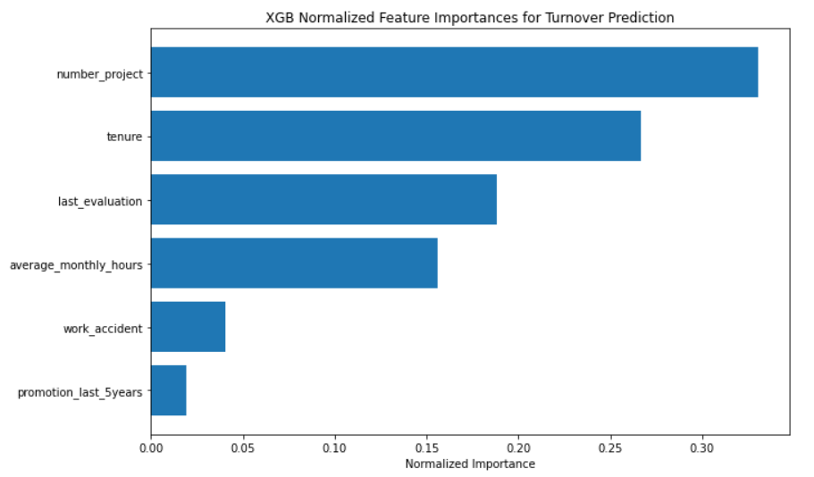
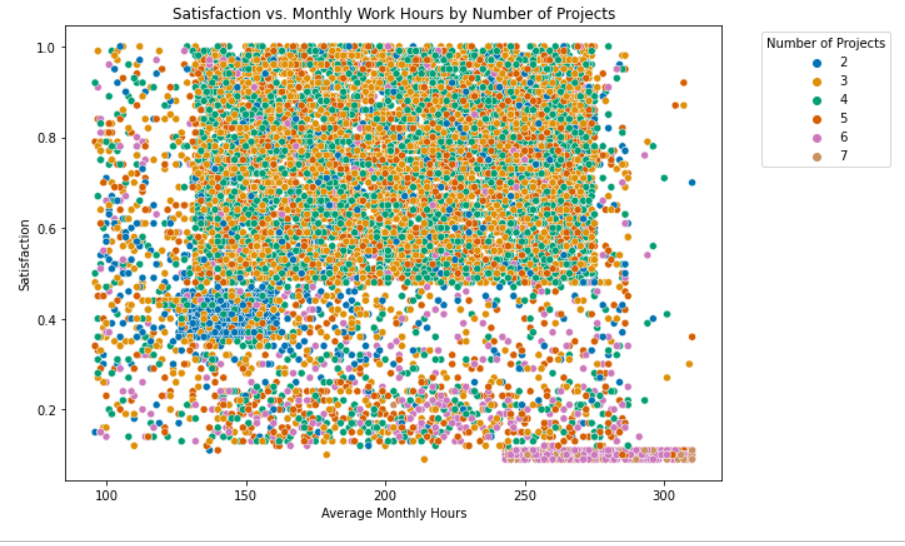
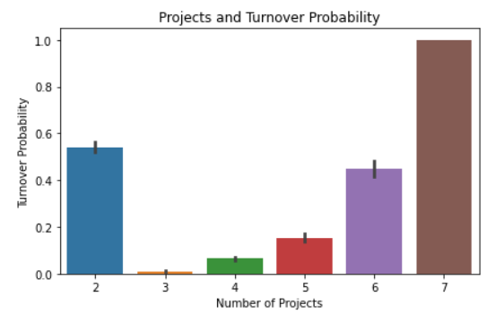
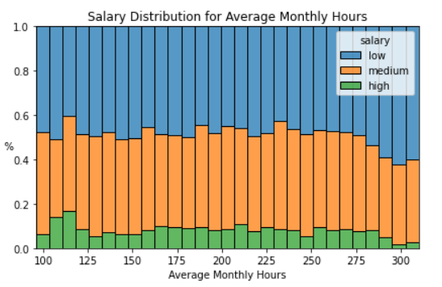

# employee-turnover-prediction
Capstone project analyzing fictional HR data to predict employee turnover using XGBoost and Random Forest.

# Employee Turnover Analysis – Salifort Motors

## Overview
This project analyzes a fictional HR dataset focused on employee turnover for *Salifort Motors*.  
The goal: **reduce recruitment and training costs** by improving employee retention and satisfaction — ultimately increasing company profit.

This report (Milestone 5) presents findings from **exploratory data analysis (EDA)** and **predictive modeling**, along with actionable recommendations to improve retention.

---

## Process
We developed **Random Forest (RF)** and **XGBoost (XGB)** models to predict both employee turnover and satisfaction. These models were well-suited for:
- Binomial outcomes (yes/no turnover)
- Datasets with mixed data types: *discrete, continuous, and categorical*
- Datasets with outliers

The **XGB left (turnover) model** performed best:
- F1 score: **0.934** (on a test set comprising 25% of the data)
- RF turnover model: 0.925
- RF satisfaction model F1 score: 0.639
- XGB satisfaction model F1 score: 0.629

Given its superior performance, we primarily relied on the **XGB turnover model** for insights, alongside EDA.

---

## Key Insights

- **number_project** was the strongest predictor of both turnover and satisfaction  
- Other top predictors of turnover: **tenure**, **last_evaluation**, and **average_monthly_hours**
  
  
  
- Two clear clusters with lower-than-average satisfaction stood out:
  - Under-employed workers managing only 2 projects
  - Overtime employees handling 6 or more projects
  These groups may represent a mismatch between effort and recognition or workload and capacity, contributing to disengagement and turnover

- Employees with 2 projects accounted for **43% of all turnover**, followed by those with 6 projects (18.6%)
- **Under-employed workers** (125–165 hours/month) **with 2 projects had** had an **82% turnover rate**  
  - By contrast:
    - Full-time workers: **2.6%**
    - Overtime workers: **6.3%**
    - Part-time workers: **0%**
- **Under-employed workers with 3 projects** had a turnover rate of **just 0.9%**, suggesting underutilization in the 2-project group
- Overall, employees with:
  - 2 projects had a turnover rate of **65.6%**
  - 6 projects: **55.8%**
  - 7 projects: **100%**
    
  
  
- Turnover increases at the 4-year mark and spikes at year 5
  - At 4 years: leavers averaged ~6 projects vs. ~4 for those who stayed
  - At **5 years**: the project gap narrows (4.76 vs. 4.21), yet **turnover rises to 56.6%**, suggesting other causes such as lack of career progression
- Salary distribution remained largely flat across average monthly hours, with a slight dip at the high end—suggesting overtime employees may not be fairly compensated for their extra time.

  
  
- **Evaluation scores rose with average monthly hours worked**
  - Overwork may be rewarded, encouraging burnout
  - Part-time workers may be undervalued, leading to increased turnover risk
- Only **1.6% of employees** were promoted
  - Yet their turnover rate was **just 3.9%**
  - Compared to **16.8%** among non-promoted peers, this highlights the potential impact of promotion on retention

---

## Recommendations

- **Balance workloads**  
  - Cap projects at 4 per employee  
  - Reassign excess work to under-employed staff with fewer than 3 projects

- **Revise performance evaluation metrics**  
  - Decouple high scores from excessive hours worked  
  - Encourage recognition of efficiency and output quality

- **Re-evaluate overtime policies**  
  - Ensure employees are compensated appropriately  
  - Monitor workloads to reduce burnout

- **Foster internal promotion pathways**  
  - Encourage career growth opportunities  
  - Begin systematically tracking promotions for future analysis

---

## Next Steps

To improve modeling and better understand drivers of turnover, expand the dataset to include:
- Salary changes and pay raises
- Certifications and skill development data
- PTO and sick leave usage
- Flexible work arrangements
- Exit interview responses and feedback

---

## Technologies Used

- Python (Pandas, NumPy, Scikit-learn, XGBoost)
- Jupyter Notebooks
- Matplotlib / Seaborn for data visualization

---

*Last updated: June 2025*
